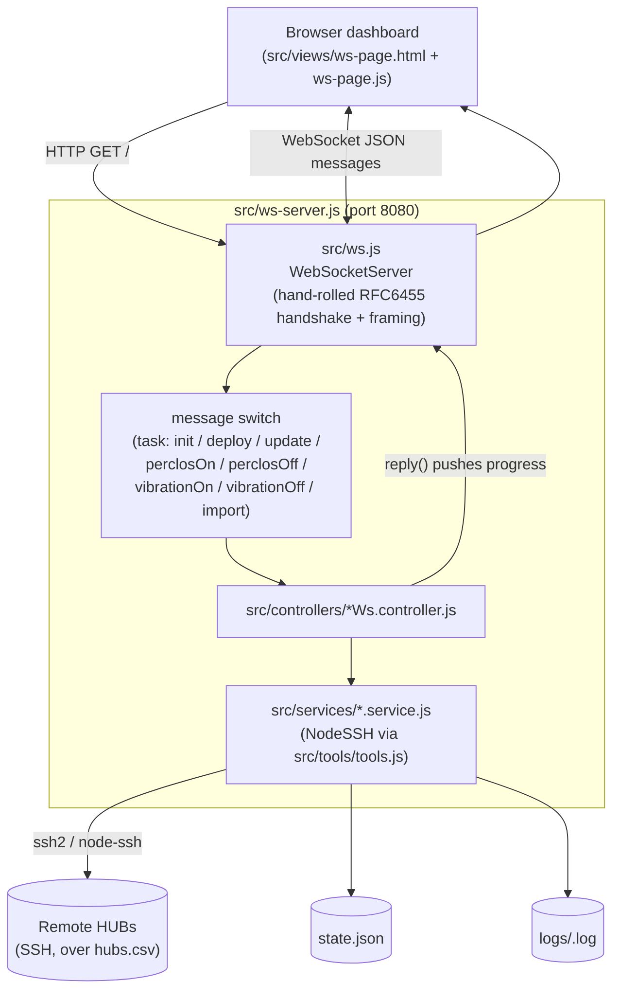

# Deploy Athena — Manual

Deploy Athena is a Node.js web app (no framework, no build step) that lets an
operator deploy/update the "Athena" drowsiness-detection software on a fleet
of remote Linux machines ("HUBs") over SSH, from a single browser dashboard.
The operator opens the dashboard, selects HUBs from a table, and triggers an
action (deploy, update binary, PERCLOS on/off, vibration on/off, or replace
the HUB list). The server runs the SSH commands against each selected HUB in
the background and pushes progress back to the browser in real time over a
WebSocket.

Software owned by **MS4M**, private license.

> This manual documents the codebase **as it currently exists in this
> checkout**. `CLAUDE.md` in the project root still describes an earlier,
> HTTP-polling architecture (`server.js`, `routes/router.js`,
> `controllers/*.controller.js`, `GET /state`) — that code is not present
> here. The only app in this tree is the WebSocket version described below.
> See [Historical context](#historical-context) for what changed.

## Quick start

```bash
npm install       # installs node-ssh, the only runtime dependency
npm run lts        # node src/ws-server.js  →  http://localhost:8080
```

`src/ws-server.js` is the **only entry point** in this checkout. It serves
the dashboard (`src/views/ws-page.html`) over plain HTTP and pushes
state/log updates over a WebSocket connection — on the **same port**,
`8080`. There are no tests, no lint config, and no build step.

## Architecture overview

Node has no built-in WebSocket server, and this project intentionally avoids
adding a dependency (`ws`, `socket.io`, etc.) for it — `src/ws.js` is a
small, hand-rolled implementation of the server side of
[RFC 6455](https://www.rfc-editor.org/rfc/rfc6455) (see
[The hand-rolled WebSocket layer](#the-hand-rolled-websocket-layer-srcwsjs)
below).



Every controller/service pair follows the same shape: look up the selected
HUBs from `hubs.csv`, open an SSH connection per HUB (`Tools.connectSSH`,
with password fallback), run the remote commands, update `state.json` +
append to `logs/<hub>.log`, and push the new state back over the socket via
the `reply` callback — so the dashboard updates without polling. Hubs are
processed **sequentially, not in parallel**, and a controller sends multiple
`reply()` pushes per batch (one per state transition per hub), not just one
at the end.

`src/ws-server.js` loads `hubs.csv` and `state.json` once into module-level
variables (`hubs`, `state`) at process startup and holds them in memory for
the life of the process; every controller call is handed these same
references. See the [Import hubs.csv](#import-hubscsv) section for a bug
this causes.

## The hand-rolled WebSocket layer (`src/ws.js`)

`WebSocketServer` (extends `EventEmitter`) is constructed with
`{ port = 8080 }` and initializes an HTTP server immediately (not lazily on
`listen()`). That HTTP server does double duty:

- **Static file server** for the bundled front-end: `GET /ws-page.css` and
  `GET /ws-page.js` serve those files from `src/views/`; any other `GET`
  serves `src/views/ws-page.html` (the catch-all/home page). Files are read
  synchronously (`fs.readFileSync`) on every request — no caching.
- **WebSocket upgrade handler**: on an `Upgrade: websocket` request, it
  computes `Sec-WebSocket-Accept` (SHA-1 of the client key + the standard
  WS GUID, base64-encoded) and writes the `101 Switching Protocols`
  response by hand, then emits `'connection'` with the raw socket. A
  `'data'` listener on that socket parses every incoming TCP chunk as one
  WebSocket frame via `parseFrame` and emits `'data'` with
  `(parsedMessage, reply)`, where `reply = (data) => socket.write(this
  .createFrame(data))` — this is the exact `reply` callback threaded through
  `ws-server.js` → controllers → services.

Public surface used elsewhere: `new WebSocketServer({ port })`, events
`'headers'`, `'connection'`, `'data'` (signature `(message, reply)`),
`'close'`, and `listen(callback)`.

`parseFrame` only handles a single, unfragmented text frame per TCP chunk
(no reassembly across multiple `data` events); non-text opcodes (binary,
ping/pong) are silently dropped, and a `close` opcode destroys the socket.
`createFrame` always `JSON.stringify`s its payload (so every `reply()` call
across the whole app must pass a serializable object, not a raw string) and
never fragments (`FIN` always set).

This was written following an existing "from scratch" walkthrough
(*Implementing a WebSocket Server from Scratch in Node.js*, Better
Programming/Medium) — read that article before touching `_init`,
`parseFrame`, `createFrame`, or `_unmask`, since the code mirrors its model
closely.

> **Known bug:** `createFrame`'s 64-bit extended-length branch checks
> `payloadByteLength === 127` instead of the `payloadLength === 127` flag
> set earlier in the function. For a JSON payload larger than 65535 bytes
> (e.g. a very large hub list or log dump pushed in one `reply()`), the
> function reserves 8 header bytes for the extended length but never writes
> the actual length into them, producing a malformed frame.

## Project layout

```
src/
  ws-server.js          entry point — wires the WebSocket server to the controllers
  ws.js                 hand-rolled WebSocket server (RFC 6455)
  config/
    config.js           SSH credentials/port, remote path, retry limit
    variables.js        paths for hubs.csv / logs / state.json / update payload
  controllers/          per-action orchestration (deploy, update, perclos, vibration, import)
  services/             per-action SSH/business logic, returns a status string
  tools/tools.js        shared statics: SSH connect, CSV parsing, state persistence, logging
  views/
    ws-page.html/.js/.css  the dashboard UI served to the browser

hubs.csv                HUB registry (name,ip) — must use Unix (LF) line endings
state.json              per-HUB status persisted across runs (safe to hand-edit/reset)
logs/<hub>.log          append-only per-HUB deploy log
connections.log         WS client connect/disconnect log (Tools.logConnection)
athena.zip              deploy payload uploaded to each HUB via SFTP (~431 MB)
fcsv143.tar             payload used by the update flow (pushed to HUBs, extracted, binary swapped in)
md/                     background docs: legacy1.md, legacy2.md, legacy3.md, this manual
```

`package.json` has no `name`/`main`/`bin` fields, `"type": "module"`
(ESM throughout), a single script `"lts": "node src/ws-server.js"`, and one
real dependency, `node-ssh` (`ssh2` and friends come along transitively).
Its `"//"` comment field notes the file is shared between a "legacy" and an
"lts" entry point, though only `lts` is currently defined.

## Config reference

`src/config/config.js` (verbatim):

```js
export const config = {
  username: "ms4m",
  passwords: ["1234", "Ms4m4dm1nhub2025"],
  remotePath: "/home/ms4m",
  maxAttempts: 5,
  port: 22
};
```

- `username` / `port` — SSH login identity used for every HUB.
- `passwords` — ordered candidates. `Tools.connectSSH` and
  `deployHub.service.js`'s `findSudoPassword` both try them in order and
  use whichever first succeeds.
- `remotePath` — remote deploy directory used by `deployHub.service.js`
  for uploading/unzipping `athena.zip`.
- `maxAttempts` — **defined but not read anywhere.** Controllers track
  their own `attempts` counter in `state.json`, but nothing compares it
  against this value or stops retrying because of it.

Dev vs. deploy credential/port values have differed historically — see
`legacy3.md` for the documented split (do not duplicate plaintext passwords
across docs; `config.js` above is the single source of truth for whichever
values are currently checked in).

`src/config/variables.js` (verbatim, all paths resolved relative to the
project root via `import.meta.url`):

```js
export const CSV_FILE = path.join(__dirname, "..", "..", "hubs.csv");
export const LOG_DIR = path.join(__dirname, "..", "..", "logs");
export const STATE_FILE = path.join(__dirname, "..", "..", "state.json");
export const UPDATE_TAR = path.join(__dirname, "..", "..", "fcsv143.tar");
export const TIMEOUT = 10000
```

`TIMEOUT` is **defined but not imported/used anywhere** — services hardcode
their own SSH connect timeouts (`10000`/`15000` ms) as literals instead.
`tools/tools.js` also independently recomputes its own copy of `LOG_DIR` —
same path, separately defined, not a bug, just duplication worth knowing
about if either ever needs to change.

## Data files

- **`hubs.csv`** — header `name,ip`, one HUB per line, no quoting. No
  native comment support — a `#` line is not skipped, it errors (or, worse,
  is parsed as a malformed row). Remove a line to exclude a HUB. Must use
  Unix (LF) line endings; a CRLF file leaves a trailing `\r` on the IP.
- **`state.json`** — flat JSON object keyed by HUB **IP** (not name). Each
  entry (fields are added incrementally, not all present on every hub):
  ```json
  "10.72.36.244": {
    "status": "SUCCESS",
    "attempts": 2,
    "lastAttempt": "2026-08-27 14:59:46",
    "updateStatus": "PENDING",
    "perclosStatus": "PENDING",
    "vibrationStatus": "PENDING"
  }
  ```
  An entry may also carry a transient `progress: { percent, action,
  transferred, total }` while an upload is in flight. Safe to hand-edit a
  HUB back to `status: "PENDING", attempts: 0` to force a redeploy, or
  delete/empty the file (`{}`) to reset everything — note that doing so
  makes previously-`SUCCESS` HUBs eligible to redeploy again (deploy is the
  only action with a "skip if already SUCCESS" guard — see below).
- **`logs/<hub>.log`** — one append-only log file per HUB (named after the
  `name` column, not the IP), each line `[YYYY-MM-DD HH:MM:SS] message`,
  written via `Tools.logToFile` (fixed UTC-5 timestamps, see
  [Shared utilities](#shared-utilities-tools)).
- **`connections.log`** (project root) — WS client connect/disconnect
  events, written by `Tools.logConnection`, separate from the per-hub logs.
- **`athena.zip`** — the deploy payload, uploaded via SFTP and
  unzipped/installed remotely by `deployHub.service.js`. ~431 MB / ~1.19 GB
  uncompressed / ~111k files — see `legacy1.md` for the full breakdown of
  what's inside it and what's safe to strip out to speed up deploys (the
  short version: `.git`, frontend build caches, and `node_modules` account
  for most of the weight; do **not** strip `server/dependencies`, since the
  offline `pip3 install --no-index --find-links=dependencies` step needs
  it).
- **`fcsv143.tar`** — the payload used by the update flow (`updateHub
  .service.js`): pushed to each HUB, extracted, and used to swap in a new
  `fcs` binary.

## Actions, end to end

Every action below is triggered by a `{ "task": "<name>", "hubs": [...ips] }`
JSON message from the browser, routed by the `switch` in `src/ws-server.js`.
Every controller responds with one or more `{ type: "state", hubs: [...],
shake? }` pushes (built by `buildStateUpdate` in `updatePage.controller.js`)
as it works through the selected HUBs.

### Deploy (`task: "deploy"`)

`deployHubWs.controller.js` → `deployHub.service.js`. The **only** action
that filters out HUBs already at `status: "SUCCESS"` before running — a
plain re-select-all-and-deploy is safe to repeat.

Per HUB: connect over SSH → probe `config.passwords` against `sudo -S -p ''
-v` (password piped via stdin, never embedded in a command string) to find
a working sudo password → upload `athena.zip` to `<remotePath>/athena.zip`
→ `unzip -o` it → run a large privileged bash script (installs `.deb`
packages, replaces the nginx site config, restarts `nginx`, `pip3 install
--no-index --find-links=dependencies -r requirements.txt`, installs/enables/
starts the `athena.service` systemd unit) → validate via `curl -s -o
/dev/null -w '%{http_code}' http://localhost` (expects `200`) and
`systemctl is-active athena` (expects `active`); on either check failing,
runs a diagnostics pass (`nginx -t`, `systemctl status nginx`/`athena`,
`ss -tlnp`, each truncated and logged).

Returns `"SUCCESS"`, `"FAILED"` (SSH connected but sudo/install/validation
failed), or `"OFFLINE"` (SSH-level failure: timeout/refused/unreachable).
Updates `state[ip].status`, `attempts`, `lastAttempt`.

### Update binary (`task: "update"`)

`updateHubWs.controller.js` → `updateHub.service.js`. No SUCCESS-skip
filter — re-running always re-pushes the binary.

Per HUB: connect → `ssh.putFile(UPDATE_TAR, "/home/ms4m/fcsv143.tar")` →
extract into `~/fcs/` → back up `~/fcs/fcs.db` → seed 5 `interface` rows
(independent of, and with different literal values than, `Tools
.ensureVibrationParams`) → verify via two `SELECT`s → stop `fcs.service`,
back up the current `fcs` binary to `fcsv42`, promote the extracted
`fcsv143` binary to `fcs`, restart, `./fcs version`.

Returns `"UPDATE_OK"`, `"UPDATE_FAILED"`, or `"OFFLINE"`. The controller
then **normalizes `"OFFLINE"` into `"UPDATE_FAILED"`** before writing
`state[ip].updateStatus` — unlike deploy's `status` field, the OFFLINE
distinction is not preserved for the update flow's UI badge.

> **Known bug:** the remote destination path is hardcoded as
> `/home/ms4m/fcsv143.tar` rather than built from `config.remotePath` the
> way `deployHub.service.js` does — if `remotePath` is ever changed, this
> upload target silently won't follow it. Its two post-insert verification
> `SELECT`s also use inconsistent `LIKE` patterns (e.g. `field like
> 'audio'` instead of `field like '%audio%'`), which look like a missing-
> wildcard typo — harmless (diagnostic logging only), but worth fixing if
> touching this file.

### PERCLOS on/off (`task: "perclosOn"` / `"perclosOff"`)

`perclosOn/OffWs.controller.js` → `perclosOn/Off.service.js`. Both toggle
thresholds in the `interface` SQLite table at `~/fcs/fcs.db` and restart
`fcs.service`. `perclosOff` sets `perclos_high`, `perclos_mid`, and
`perclos_low` all to `100` (effectively disables the feature by maxing out
every threshold); `perclosOn` sets only `perclos_mid=30` and
`perclos_low=20` (does **not** touch `perclos_high` — asymmetric with
`perclosOff`, which resets all three).

Returns `"PERCLOS_ON_OK"`/`"PERCLOS_OFF_OK"`, a `*_FAILED` string, or
`"OFFLINE"`. The controller sets `state[ip].perclosStatus` to `IN_PROGRESS`
while running; on success it becomes `PERCLOS_ON`/`PERCLOS_OFF`; **on
failure it reverts to whatever it was before the attempt** (no persisted
FAILED status) and the reply always includes `shake: { ip, field:
"perclos" }` so the dashboard flashes that row's PERCLOS badge.

### Vibration on/off (`task: "vibrationOn"` / `"vibrationOff"`)

`vibrationOn/OffWs.controller.js` → `vibrationOn/Off.service.js`. Same
overall shape as PERCLOS: connect, call `Tools.ensureVibrationParams` to
seed/dedupe any missing `interface` rows, toggle `microsleep_vibration`
(`0` for off, `1` for on — `light_drowsy_vibration`/`very_drowsy_vibration`
are left untouched by both directions), verify, restart `fcs.service`.
`vibrationOff` additionally backs up `~/fcs/fcs.db` before making changes;
`vibrationOn` does not.

Returns `"VIB_ON_OK"`/`"VIB_OFF_OK"`, a `*_FAILED` string, or `"OFFLINE"`.
Same revert-on-failure behavior as PERCLOS for `state[ip].vibrationStatus`,
**but** the `shake` hint is only attached if the HUB had already been
toggled at least once before (`previousVibration === "VIB_ON" ||
"VIB_OFF"`) — a HUB's very first failed vibration attempt does not shake.
This is an intentional-looking but undocumented asymmetry with the PERCLOS
controllers, which always shake on failure.

### Import hubs.csv (`task: "import"`)

`loadHubs.controller.js`. The dashboard's CSV-replace button reads the
selected file client-side (`FileReader`) and sends its text content,
JSON-stringified, as `data.hubs`. The controller `JSON.parse`s it back to a
string and writes it to disk.

> **Known bug (two parts):**
> 1. It writes to the **relative** path `./hubs.csv` (resolved against the
>    process's current working directory), not the absolute `CSV_FILE`
>    constant from `config/variables.js` that every other read of the hub
>    list uses. If the process isn't started from the project root, this
>    silently writes a different file than the one `Tools.parseCSV()`
>    reads.
> 2. On success it does `hubs = parseCSV()` — reassigning its own local
>    `hubs` **parameter**. This does not mutate the `hubs` array held in
>    `ws-server.js`'s module-level closure (JS parameter reassignment is
>    local). The reply for *this* request correctly reflects the new CSV,
>    and the file on disk is correct, but every subsequent WS task in the
>    same running process (e.g. the next `deploy`) still uses the stale
>    in-memory hub list until the server process is restarted.

## Shared utilities (`Tools`)

`src/tools/tools.js` exports a single `Tools` class of static helpers used
throughout the app:

- **`connectSSH(ssh, hub, timeoutMs = 15000)`** — opens an SSH connection,
  trying each password in `config.passwords` in order. Stops and re-throws
  immediately on a non-authentication error (network/timeout); only
  advances to the next password on an auth failure. Throws once all
  passwords are exhausted.
- **`logToFile(hub, msg)`** — appends `[<Tools.now()>] <msg>\n` to
  `logs/<hub.name>.log` (creates the file if missing). Synchronous I/O on
  every call.
- **`logConnection(msg)`** — appends a timestamped line to
  `connections.log` at the project root; used only by `ws-server.js` for
  WS connect/close events.
- **`now()`** — returns `YYYY-MM-DD HH:MM:SS`, computed by manually
  shifting `Date.now()` by a hardcoded `-5` hour offset. This is **not**
  timezone-database-aware — no DST handling, just a fixed UTC-5 offset.
- **`parseCSV()`** — reads `CSV_FILE`, drops the header line, splits each
  remaining line on `,` into `{ name, ip }` (trimmed). No quoting/escaping
  support; throws if the file is missing.
- **`loadState()` / `saveState(state)`** — read/write `STATE_FILE` as
  pretty-printed JSON; `loadState` returns `{}` if the file doesn't exist.
- **`statusBadge(status)`** — renders an inline-styled HTML `<span>` for a
  HUB's top-level deploy `status` (color-coded: green `SUCCESS`, red
  `FAILED`, gray `OFFLINE`, amber `IN_PROGRESS`, slate `PENDING`/unknown).
  The server ships this pre-rendered HTML string to the client, which
  injects it via `innerHTML`.
- **`ensureVibrationParams(ssh, log)`** — idempotent seed helper shared by
  both vibration services: if the `interface` table has no
  `microsleep_vibration` row, inserts the 5 default vibration rows, then
  deduplicates by keeping only the highest-`rowid` row per `field`.

Conventions established here and reused across every perclos/vibration
service: the remote SQLite DB always lives at `~/fcs/fcs.db`, its
`interface` table always has columns `(idx, field, value)`, and the app is
always restarted with `systemctl --user restart fcs.service`.

## Client dashboard

`src/views/ws-page.html` + `ws-page.js` + `ws-page.css` — a single-page,
dark-themed dashboard (Spanish UI), served as static files by `ws.js`
itself (see above).

- Connects with `new WebSocket(\`ws://${location.hostname}:8080\`)` — same
  host, same port as the HTTP page, `ws://` scheme, no path. Sends
  `{ task: "init" }` immediately on open to request the first state
  snapshot.
- Sends `{ task, hubs }` for every action (`hubs` = array of selected IP
  strings), and `{ task: "import", hubs: <JSON-stringified CSV text> }` for
  the CSV-replace flow.
- Renders **only** on `{ type: "state", hubs: [...], shake? }` messages —
  the entire `<tbody>` is rebuilt from `hubs` on every push
  (`tbody.innerHTML = ...`). There is no client-side polling or interval;
  it is fully push-driven. A truthy `shake: { ip, field }` adds a brief CSS
  shake animation to that row's PERCLOS/vibration badge cell.
- The HTML/CSS include a "terminal" log panel (`#terminal`, with
  `.err`/`.warn`/`.info` color classes and a "limpiar" clear button) that
  is **not wired up** in `ws-page.js` — no code writes into it and its
  `clearTerminal()` handler isn't defined. Treat it as unfinished/dead UI,
  not a bug to preserve behavior around.
- Table columns: checkbox, Equipo (name), IP, Deploy (status badge), Último
  intento (last attempt), Binario (update badge), PERCLOS badge, Vibración
  badge.

## Status values reference

| Field (`state.json`) | Possible values |
|---|---|
| `status` (deploy) | `PENDING`, `IN_PROGRESS`, `SUCCESS`, `FAILED`, `OFFLINE` |
| `updateStatus` | `PENDING`, `UPDATE_PROGRESS`, `UPDATE_OK`, `UPDATE_FAILED` |
| `perclosStatus` | `PENDING`, `IN_PROGRESS`, `PERCLOS_ON`, `PERCLOS_OFF` |
| `vibrationStatus` | `PENDING`, `IN_PROGRESS`, `VIB_ON`, `VIB_OFF` |

(`UPLOADED`/`INSTALLED` appear in the older `auto-deploy2.js`-era docs but
are not states this codebase's `deployHub.service.js` writes — it only ever
resolves to `SUCCESS`/`FAILED`/`OFFLINE`.)

## Known issues

1. **`ws.js` `createFrame`** — the >65535-byte extended-length branch
   checks the wrong variable and never writes the real length, producing a
   malformed frame for very large `reply()` payloads. See
   [The hand-rolled WebSocket layer](#the-hand-rolled-websocket-layer-srcwsjs).
2. **`loadHubs.controller.js`** — writes the imported CSV to a
   process-CWD-relative path instead of the absolute `CSV_FILE`, and its
   parameter reassignment doesn't update the in-memory hub list used by
   other controllers until the process restarts. See
   [Import hubs.csv](#import-hubscsv).
3. **`updateHub.service.js`** — hardcodes the remote upload path instead of
   using `config.remotePath`, and two diagnostic `SELECT`s use `LIKE`
   patterns that look like they're missing `%` wildcards. See
   [Update binary](#update-binary-task-update).
4. **Dead config** — `config.js`'s `maxAttempts` and `variables.js`'s
   `TIMEOUT` are defined but never read anywhere in the current code.
5. **PERCLOS vs. vibration `shake` asymmetry** — PERCLOS controllers always
   send the `shake` UI hint on failure; vibration controllers only send it
   if the HUB had already been toggled before. Likely intentional, but
   undocumented until now. See
   [Vibration on/off](#vibration-onoff-task-vibrationon--vibrationoff).

> Note: an earlier version of this project's docs (`CLAUDE.md`) described a
> bug in `updateHub.service.js`/`deployHub.service.js` involving missing
> `path`/`connectSSH` imports. That bug is **not present** in either file as
> currently written in this checkout — both import everything they use.
> Treat that specific claim in `CLAUDE.md` as stale.

## Historical context

This is (at least) the third documented generation of this project's
architecture, and the docs from the earlier two are still in `md/` for
reference — they are **not** describing the code in this checkout:

- **`legacy1.md`** — operations manual for `auto-deploy2.js`, a standalone
  CLI deploy script (no WebSocket, no dashboard). Still useful today for
  its detailed breakdown of `athena.zip`'s size/contents and why deploys
  are slow (referenced above).
- **`legacy2.md`** — configuration reference for the same `auto-deploy2.js`
  / `config.js` era: credentials, `hubs.csv` format, hardcoded timeout
  constants (`CONNECT_TIMEOUT_MS` etc.), `state.json` semantics,
  troubleshooting by symptom. The `hubs.csv` conventions and `state.json`
  reset semantics it documents still hold; the timeout constants and
  `config.js` module-export shape it describes do not (see
  [Config reference](#config-reference) for the current shape).
- **`legacy3.md`** — credentials note (dev vs. deploy SSH config) and a
  short "3-layered architecture... polling technique in the frontend"
  description of a prior **HTTP REST API + client polling** version. That
  polling architecture does not exist in this checkout — everything here is
  WebSocket push-based (see [Client dashboard](#client-dashboard)).
- `README` (project root) also documents the current WS architecture and
  credits `md/lts.md` for the WebSocket-from-scratch implementation model —
  that file does not currently exist in `md/`; treat the reference as
  dangling rather than assuming it holds anything beyond what's summarized
  in [The hand-rolled WebSocket layer](#the-hand-rolled-websocket-layer-srcwsjs)
  above.
- `deploy-athena-runtime.architecture.json` — a diagram-tool spec covering
  the same components (UI, server, hubs.csv, state.json, logs, SSH, remote
  hubs, Athena app) at a coarse level; accurate but doesn't capture the
  WebSocket-specific transport detail this manual does.
